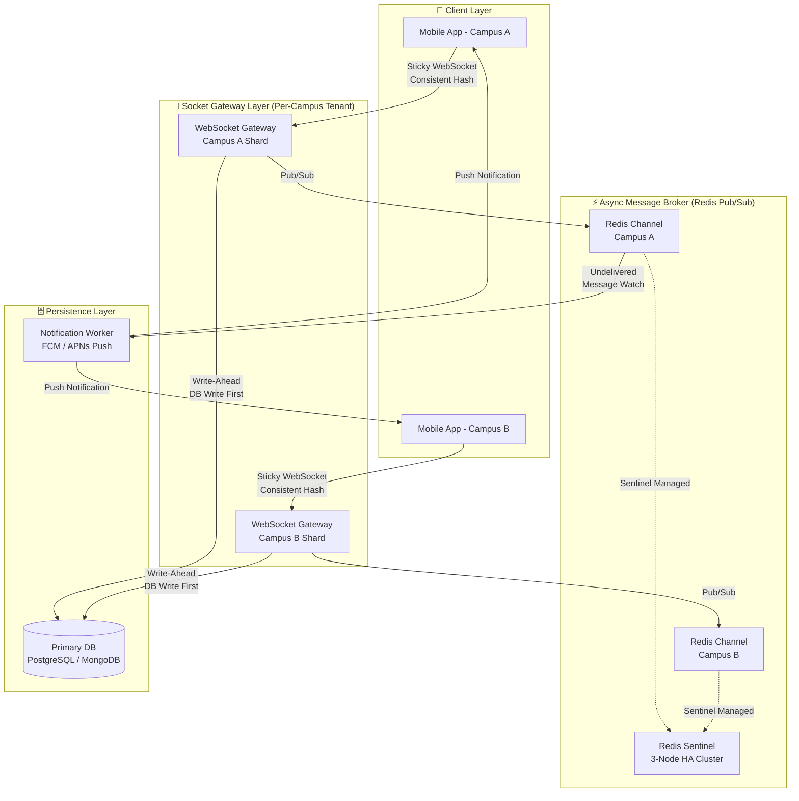
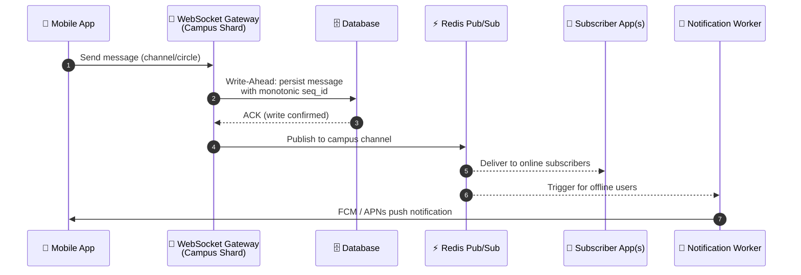
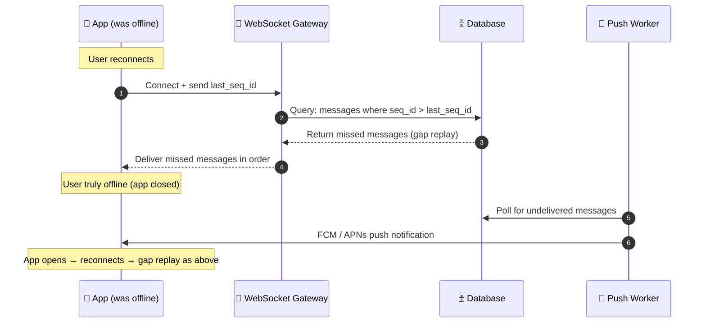
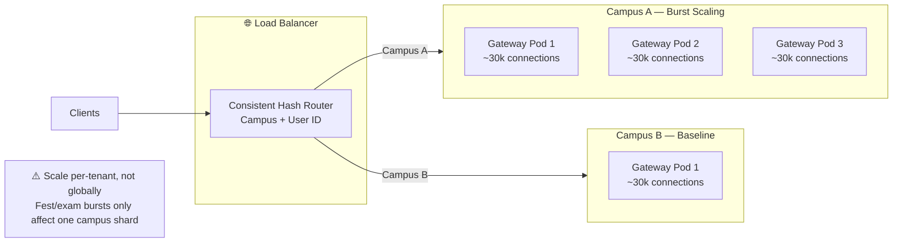
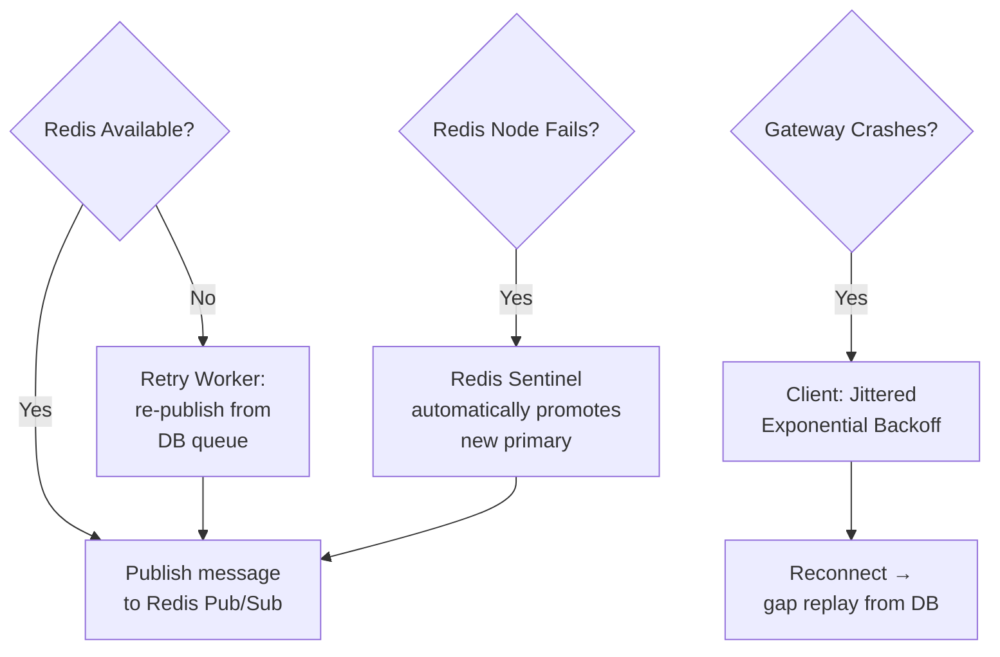
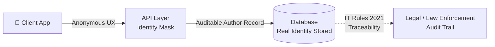

# Campus-Scoped Real-Time Messaging — Backend Architecture

> **Proposed by:** Sujal Chaprana  
> **Context:** Low-latency, horizontally scalable, campus-scoped anonymous messaging system  
> **Compliance:** IT Rules 2021 (traceability at storage layer, masked at API layer)

---

## 1. High-Level System Overview

---

## 2. Message Flow — End to End

> **Key Principle:** DB write always happens **before** Redis publish. No message is silently dropped.

---

## 3. Offline User Delivery (Push + Pull Hybrid)

---

## 4. Gateway Scaling Strategy

| Parameter | Value |
|-----------|-------|
| Connections per Gateway Pod | ~30,000 |
| Session Strategy | Sticky (Consistent Hash: campus + user) |
| Scaling Unit | Per-campus tenant (not global) |
| Health Check | Heartbeats + idle timeouts |
| Recovery | Jittered exponential backoff (thundering herd prevention) |

---

## 5. Failure Handling

### Failure Matrix

| Failure Scenario | Mitigation | Message Loss? |
|---|---|---|
| Redis unavailable | Retry worker re-publishes from DB queue | ❌ Never |
| Redis node failure | Redis Sentinel (3-node) auto-failover | ❌ Never |
| Gateway crash | Client jittered backoff → reconnect → gap replay | ❌ Never |
| User offline | Write-ahead DB + Push (FCM/APNs) + gap replay on reconnect | ❌ Never |
| Broker overload | Horizontal scale per-campus shard | ❌ Never |

---

## 6. Identity & Compliance Layer

- **API Layer:** Strips identity before delivering content to clients (anonymous UX)
- **Storage Layer:** Retains auditable author records with full traceability
- **Compliance:** Satisfies IT (Intermediary Guidelines) Rules 2021 traceability requirements without compromising anonymous user experience

---

## 7. Trade-offs Summary

| Concern | Trade-off | Mitigation |
|---|---|---|
| Redis fire-and-forget | Messages not stored by default | Write-ahead to DB before Redis publish |
| Tenant isolation | Routing complexity increases | Offset by fault isolation and targeted scaling |
| Schema migrations | Must run across all campus shards | Additive-only migrations; blue-green rollouts per shard |
| Campus-edge alternative | Per-campus auth infra + cert mgmt balloons cost | Rejected in favour of centralized cloud + logical sharding |

---

## 8. Tech Stack Summary

| Component | Technology |
|---|---|
| Client | Mobile App (iOS / Android) |
| WebSocket Gateway | Node.js / Go (per-campus pods) |
| Message Broker | **Redis Pub/Sub** (Kafka if scale demands) |
| High Availability | Redis Sentinel (3-node) |
| Database | PostgreSQL / MongoDB |
| Push Notifications | FCM (Android) + APNs (iOS) |
| Orchestration | Kubernetes (HPA per campus tenant) |
| Session Routing | Consistent hash (campus + user ID) |

---

*This document reflects the architecture discussed and proposed for a secure, scalable, campus-scoped real-time messaging backend.*
